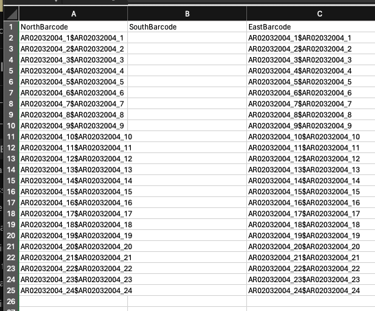

# LDM User Guide

This guide describes the usage of the app from the user's perspective, focusing on the app interface. It outlines a typical workflow that a user might follow once the app is completely set up.

**Note**: Before using the LDM, make sure that all the plate barcodes are unique. This concerns all types of plates: experiment run plates, compound library plates, and control plates. Duplicate barcodes can lead to errors in the app's workflow.

## Navigation Tree

The left panel of the web app contains the navigation tree. The tree is divided into three main sections:

- **Projects**: This section lists all the projects that the user has access to. Users can create new projects and view the details of existing projects. A project expands to show a list of experiments.

- **Compound Libraries**: This section houses all the compound libraries uploaded by the user. Each library expands to reveal a list of plates. Clicking on a plate opens its corresponding page.

- **Management**: Clicking on the management section opens the management page, where most operations are conducted. The management menu item expands to show a directory tree, mirroring the directory that was mounted as the main data storage directory during the installation process. Typically, this is a directory on the server where the app is deployed. Users can add files to it using tools like Cyberduck, FTP clients, or configure lab devices to automatically upload output files to this folder.


## Starting a Workflow

### Create a new project

 A typical workflow begins by creating a new project. This is accomplished by right-clicking on the 'Projects' navigation item. The app can be configured to either use a custom project name or to select one from a project management tool like Harvest, provided that the latter offers an API. Once a project is created, you can click on its name to open the project page, where the project name and details can be edited.

### Create a new experiment
 A project can contain several experiments, with each experiment typically corresponding to one run. To create a new experiment, right-click on the project name and select 'New Experiment'. This action opens the experiment page, where you can edit the experiment name and details.


### Upload a Control Plate Layout

Most experiments leverage a control plate to validate measurements and ensure accuracy. 
The user needs to upload the control plate layout <span style="color: salmon;">before uploading the echo-output files</span> (otherwise, the QC metrics can not be calculated).
The control plate layout must adhere to a specific format, outlined as follows:

- **File Format**: The layout should be in a `.csv` (comma-separated values) format.
- **Structure**: Each row in the file corresponds to a row on the control plate, with each cell representing a well. For wells containing a compound or DMSO, the compound's name should be specified. For empty wells, use the word `null` to indicate no compound. Following the rows that represent the control plate layout, include an empty row to signify the end of the section. After this separator, repeat the layout to denote the type of control for each well: `P` for positive control, `N` for negative control, and `C` for the rest of the wells.

You can download an example control plate layout [here](./example_files/control_plate_example.csv).
The structure of the `.csv` file should resemble the following pattern, where `Staurosporine`, `DMSO` and other names represent actual compounds, and `null` denotes empty wells. The layout specifies the content of each well in the first section, followed by an empty row, and then the control designations (`P`, `N`, or `C`) in the repeated layout:

- **Uploading**: 

1. Navigate to the **management page**, where most data management operations are conducted.
2. Select the **"Import control plate"** tab.
3. In the expandable menu on the left, click on the file name. The name of the file will then be displayed above the action box.
4. **Drag and drop** or type the file name into the file name field.
5. Specify the **name of the project**. Note: Each project can have several control plate layouts to be used in different experiments.
6. Specify the **plate barcode**. This barcode should be unique and correspond to the barcode of the physical control plate used in the experiment and in the echo files. 
7. After uploading, the layout will appear under the project node in the navigation tree.


### Upload Echo Output Files

1. Navigate to the **management page**. 
2. Select the **"ECHO/M1000"** tab and the Echo machine.
3. In the expandable menu on the left, click on the file name. The name of the file will then be displayed above the action box.
4. **Drag and drop** or type the file name into the file name field.
5. Specify the **name of the experiment**. Note: experiment names should be unique throughout the entire usage of the app.
6. If the column names in your echo output files differ from the default ones, you should specify a mapping file. 
7. After uploading, experiment plates will appear in the navigation tree under the corresponding experiment node.

### Upload M1000 Output Files

1. Navigate to the **management page**.
2. Select the **"ECHO/M1000"** tab and the M1000 machine.
3. In the expandable menu on the left, click on the file name. The name of the file will then be displayed above the action box.
4. **Drag and drop** or type the file name into the file name field.
5. Specify the **name of the experiment**. Note: experiment names should be unique throughout the entire usage of the app.
6. You can specify the name of the measurement. If not specified, the default name is "label1". If you have several measurements per file, you can specify the names separated by commas.
7. After uploading the files, you can see the result heat map on a plate's page. Also, the basic QC metrics are calculated and displayed on the experiment page.


## Experiment page
The experiment page contains several additional tools for data visualization and analysis. 

1. Generate a barcode-file
The experiment page has a tool for creating barcode specifications for the plates.
This tool is useful if you need to provide a .csv file with the plate barcode to the Echo device. 
After specifying details such as barcode-prefix ans the sides of the plate, you can download the .csv file with the barcode specifications.


The generated file will look as follows:


2. All plates view
After the measurement data was uploaded, you can see the heatmaps for all the plates at once by clicking on the **"Show measurement results"** button. The processing might take some time, especially if the number of plates is large.
The **Smaller map view** slider allows you to adjust the size of the heatmaps for better visibility. On the experiment page, the colors are scaled for the entire experiment, so the same color corresponds to the same value on different plates.
On an individual plate view, on the other hand, the colors are scaled for this particular plate separately, so the same color can correspond to different values on different plates.


3. Add a new measurement to the experiment
You can add a new measurement to the experiment by clicking on the **"Add measurement"** button.
This will open the measurement calculator where zou can make operations with the existing measurements and create new ones, like, for example, the logarithm of the existing measurement.

 

4. Export the experiment data

The **Download csv data** button allows you to download the data from the experiment in a .csv format. 
The file will contain the plate barcode, the well barcode, the compound name, and the measurement value.

5. Generate report

By clicking the **Generate report** button, you can create a PDF report for the experiment. 
The report is based upon the Jupyter notebook template which should be previously created in the integrated Notebook tool. 
  
## Integrated Jupyter Notebook Tool

Open the Notebook section by clicking on the **Notebook**  item in the menu.


# How to start the app 
## Getting started

1. Clone it from github

```bash
git clone git@github.com:ETH-NEXUS/lab_management.git
```

2. Create the `.env` file

```bash
cd lab_management
cp .env.TEMPLATE .env
vi .env
```

&rarr; Replace all the `<>`.

3. Run it

```
make up
```

## Import a compound library

In the api container run:

```bash
./manage.py import sdf -i /data/S230470.sdf -m /data/S230470_mapping.yml -r 16 -c 24
```

## Map echo output files

In the api container run:

```bash
./manage.py map echo -i /data/echo 
```

If you have not created barcode specifications for the plates in the ui, provide the experiment name so that they can be created during mapping:

```bash
./manage.py map echo -i /data/echo --experiment_name exp3
```

If the column names in your echo output files differ from the default ones, you should specify a mapping file:

```bash
./manage.py map echo -p /data/echo -m /data/echo_mapping.yml
```

## Map M1000 measurement files

In the api container run:

```bash
./manage.py map m1000 -p /data/m1000
```

If you need to apply a custom formula to the result values, e. g. to find the Acceptor/Donor ratio, you can specify the formula and provide the name of the result measurement value in the command as follows:
```bash
./manage.py map m1000 -p /data/m1000 -e Acceptor/Donor -n result_value
```

You can apply several formulas separating them with commas (in this case, you need to provide the same number of names for the result measurement values):
```bash
./manage.py map m1000 -p /data/m1000 -e Acceptor/Donor,Acceptor*Donor -n ratio,product
```

If you know that for some reason some destination plates were not created by the echo mapping, you can create them during the measurement mapping. 
For this, you need to add two parameters to the command: 

```bash
./manage.py map m1000 -p /data/ex3/M1000 --create_missing_plates --experiment_name exp3

```
Import control plate

```bash
./manage.py import library_plate -i /data/control_palte_example.csv --library_name controls_library --plate_barcode control12345

```
